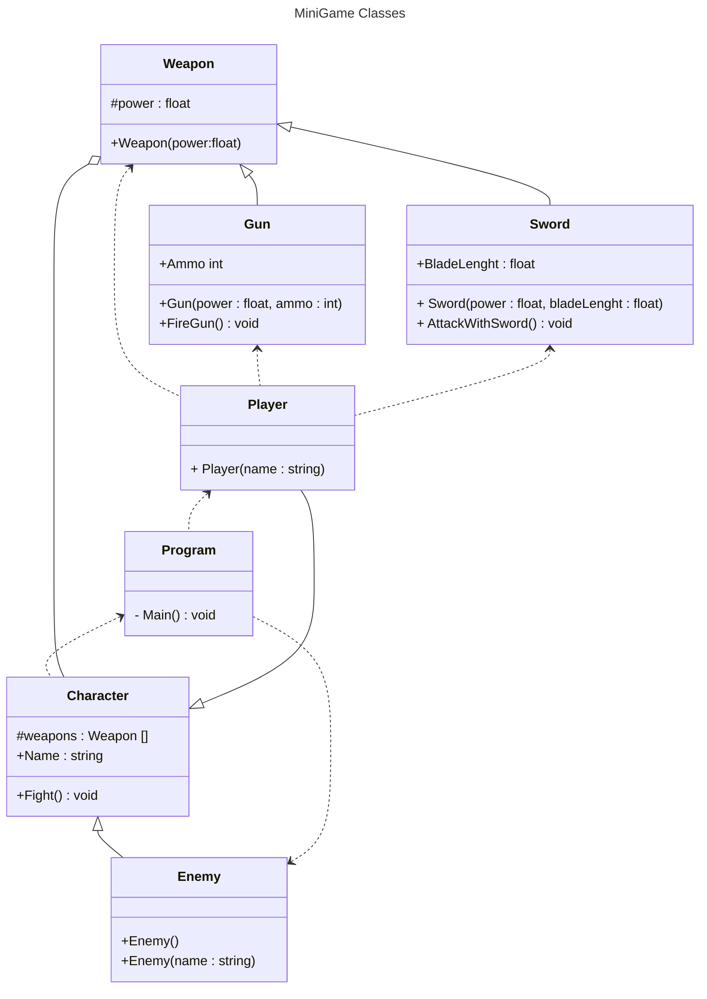

```mermaid
---
title : MiniGame Classes  
---
classDiagram

class Weapon {
    #power : float
    +Weapon(power:float)
}
class Character {
    #weapons : Weapon []
    +Name : string
    +Fight() void

}
class Enemy {
    +Enemy ()
    +Enemy (name : string) 
}

class Gun {
    +Ammo int
    +Gun (power : float, ammo : int)
    +FireGun() void
}

class Player {
    + Player (name : string)
}

class Sword {
    +BladeLenght : float
    + Sword(power : float, bladeLenght : float)
    + AttackWithSword() void
}

class Program {
    - Main() void
}
Character <|-- Enemy
Character <|-- Player
Program <.. Character
Weapon <|-- Sword
Weapon <|-- Gun
Weapon o-- Character
Weapon <.. Player
Gun <.. Player
Sword <.. Player
Player <.. Program
Enemy <.. Program

```